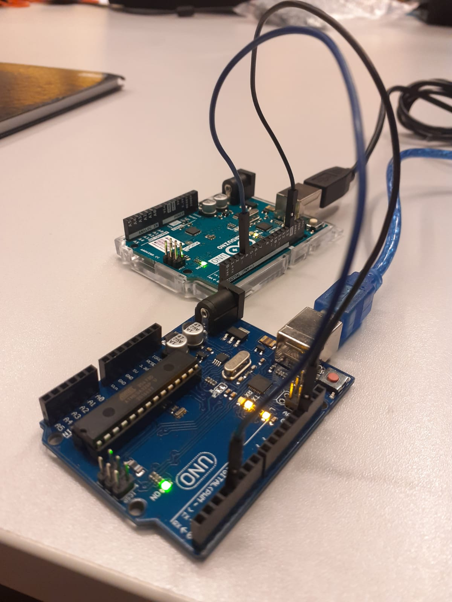
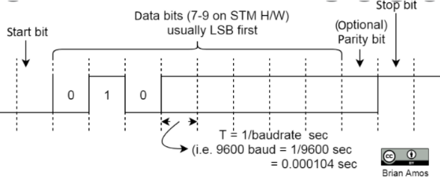

  <h2> UART-Serialization </h2>

O objetivo desse projeto é a serialização de um byte e enviá-lo através de 1 pino digital qualquer de um Arduino para outro Arduino, que receberá a mensagens no padrão UART através de outro pino digital qualquer. Dessa forma, criasse um algoritmo que produza a saída UART em um pino digital
genérico, nao utilizando, desse modo, os pinos **Tx** e **Rx** do Arduino. 
 
  
Para um exmeplo prático do funcionamento imagine que deseja enviar o caracter "A" , para isso ele é codificado por meio da tabela ASCII e o envio de bits segue o frame UART definido previamente no código.

  

  
 

---

<h4> ⚙️ Configurações Padrões </h4>

---

O padrão inicial de configuração do fram UART é definido a seguir:
  
- 1 **PARITY** bit
  
- 1 **START** bit
  
- 1 **STOP** bit
  
- Baudrate de **9600 bits/s** 

 

  

---

<h4> 📍️ Montagem </h4>

---

Para a montagem do projeto é necessário possuir:

- 2 Arduinos 

- Jumpers 

- 2 cabos USB AM/BM 2.0

- Arduino IDE , caso nao possua, pode baixar nesse [link](https://docs.arduino.cc/software/ide-v2/tutorials/getting-started/ide-v2-downloading-and-installing).

 

<h4> 💻️ Funcionamento do código </h4>

Tendo realizada a montagem, realize ocarregamento do código em ambos os arduinos. 
 

Seu código sera carregado no Arduino transmissor (arquivo `due_sw_uart_TX/due_sw_uart_TX.ino`), enquanto o Arduino Receptor deverá estar , também, previamente carregado seu código o código (arquivo `due_sw_uart_RX/due_sw_uart_RX.ino`). 
 

O Arduino que receberá o byte enviado já estará programado para escreve o recebimento na saída serial, dessa forma, você poderá observar se o recebimento ocorreu através do **Monitor Serial** do Arduino receptor. Para acessar o monitor serial clique em **Ferramentas > Monitor Serial**.
 

A letra enviada pelo transmissor deve aparecer no monitor serial do Arduino Receptor, caso isso ocorra, a transmissao da letra por meio do pino digital foi um sucesso! 
 

🧐️ Transmitimos uma letra, mas como fariamos para transmitir uma frase inteira? Essa eu deixo com vocês! Interajam com o código e divirtam-se! .
